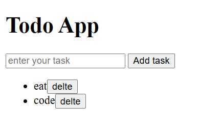

# Todo App

A simple Todo App built using HTML and JavaScript.  
It allows users to add and delete tasks easily.

---

## Features
- Add new tasks
- Delete tasks
- Simple and interactive UI

---

## Tech Stack
- HTML
- JavaScript

---

## Screenshot

---

## How to Use
- Open the project folder
- Run `index.html` in your browser
- Start adding tasks

---

## Future Improvements
- Add CSS for better UI
- Save tasks in local storage
- Mark tasks as completed

---

## Author
Diksha Taur
